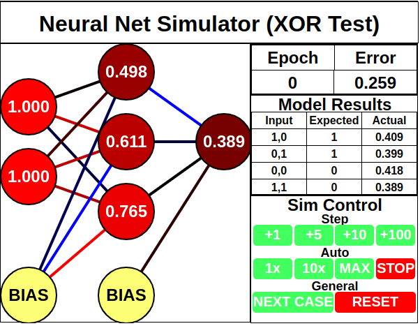
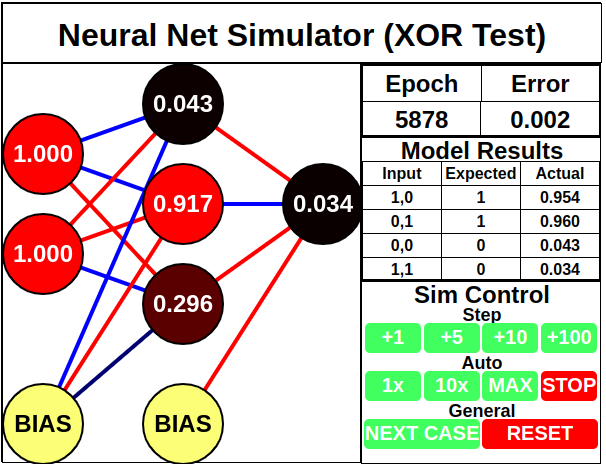

# backprop-visualizer
A small web applet to visualize training of a neural network using backpropagation.

Uses [node-backprop](https://github.com/piman51277/node-backprop) under the hood for the neural network.

